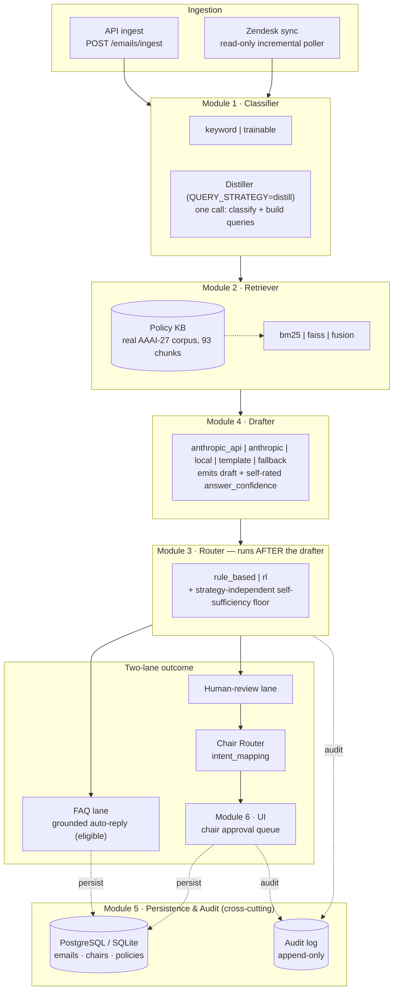
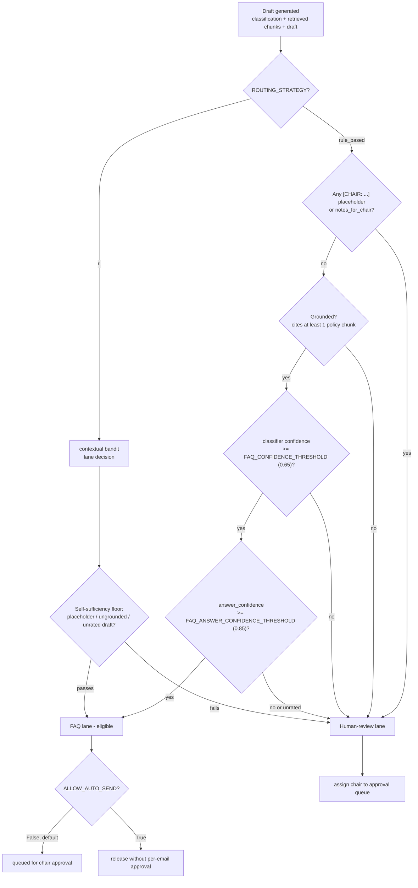

# ConfMail — Automated Conference Email Reply & Routing System

> An AI-powered email management platform for academic conference organizations. Built for the Melady Lab at USC, piloting on **AAAI-27**, with NeurIPS/ICML/ICLR as longer-term targets.


---

## Overview

Conference program chairs receive thousands of emails per cycle — submission-deadline questions, formatting queries, reviewer-assignment issues, appeals, and CMS support requests. Most are repetitive and answerable from public policy documents. A minority require genuine human judgment.

ConfMail separates these two classes automatically.

**FAQ lane** — When (and only when) a generated reply is fully grounded, self-contained, and high-confidence, it becomes eligible for auto-reply. No hallucinated policies: every sentence is traceable to a retrieved source chunk.

**Human-review lane** — Novel, ambiguous, low-confidence, or incomplete emails are routed to a chair queue with an AI-generated draft. Each is assigned to the responsible chair (Program, Diversity & Ethics, Local Arrangements, Publicity/Sponsorship, or a General fallback). Chairs approve, edit, or reroute — with a full audit trail, and reroutes captured as a future training signal.

This is a **research-grade MVP**. Every component — classifier, retriever, router, chair router, drafter, persistence — is a separate, config-flag-swappable module (an explicit architectural boundary, never mixed). It integrates live with Zendesk (read + write-back) and runs against the **real AAAI-27 policy corpus**.

---

## Architecture

The six modules are independently replaceable. A key property of the current design: **the router runs *after* the drafter** — FAQ eligibility is a property of the *generated draft's* quality (grounded, complete, confident), not of the intent label alone.



### Two-lane routing decision

Where the confidence thresholds, routing strategy, self-sufficiency floor, and transport gate fit:



> Non-LLM drafters report `answer_confidence = None`, which fails the floor by design — so a draft is never auto-eligible unless a model explicitly rated it. `ALLOW_AUTO_SEND` stays `False` until production sign-off; today every send requires explicit chair approval.

### Pipeline module backends

| Module | Backend options | Notes |
|---|---|---|
| **Classifier** | `keyword` · `trainable` | 14-intent taxonomy (5 families) single-sourced in `taxonomy.py`. Trainable backend = sentence-embeddings + LogisticRegression; auto-falls back to keyword until trained |
| **Retriever** | `bm25` · `faiss` · `fusion` | Grounds replies in the real AAAI-27 corpus (93 chunks from 6 official policy docs). `bm25` lexical; `faiss` dense (CPU sentence-embeddings, `IndexFlatIP` cosine); `fusion` = reciprocal-rank fusion. **Default `fusion`** (E003: distill+fusion lifted hit@3 .649 → .892 on real tickets) |
| **Router (lane)** | `rule_based` · `rl` | Runs after the drafter. `rl` = online epsilon-greedy contextual bandit updated on approve/reroute (groundwork; `rule_based` is the default path) |
| **Chair Router** | `intent_mapping` | Second routing decision — which chair owns a human-review email; matches classified intent to each chair's areas, falls back to a general chair. Literal is a swap seam for a future learned policy |
| **Drafter** | `anthropic_api` · `anthropic` · `local` · `template` · `fallback` | `local` = self-hosted OpenAI-compatible endpoint (pending GPU); `template` = zero-model, verbatim-grounded; `fallback` = deterministic no-network stub |
| **Query strategy** | `prefix` · `distill` | `distill` rewrites the email into 1–3 policy-vocabulary queries **and** classifies intent in one call; any failure falls back to keyword classifier + prefix query. **Default `distill`** |
| **Persistence** | PostgreSQL · SQLite | PostgreSQL in Docker (production/demo); SQLite is the safe local/test/CI default. Single async `DATABASE_URL` drives both the app engine and Alembic |

---

## Configuration

All backend behavior is env-driven (`backend/.env`; see `backend/.env.example`). Flags below are pulled from `app/core/config.py`; defaults are the **code defaults**.

### Swappable module seams

| Flag | Options | Controls | Default |
|---|---|---|---|
| `MODEL_PROVIDER` | `anthropic_api` · `anthropic` · `local` · `template` · `fallback` | Drafter backend | `anthropic_api` ¹ |
| `CLASSIFIER_BACKEND` | `keyword` · `trainable` | Classifier backend | `keyword` |
| `RETRIEVAL_BACKEND` | `bm25` · `faiss` · `fusion` | Retriever backend | `fusion` |
| `QUERY_STRATEGY` | `prefix` · `distill` | Retrieval-query build (+ intent) | `distill` |
| `ROUTING_STRATEGY` | `rule_based` · `rl` | Lane router | `rule_based` |
| `CHAIR_ROUTING_STRATEGY` | `intent_mapping` | Which chair a human-review email goes to | `intent_mapping` |

### Routing / confidence tuning

| Flag | Type | Controls | Default |
|---|---|---|---|
| `CONFIDENCE_THRESHOLD` | float | General classifier-confidence floor | `0.75` |
| `FAQ_CONFIDENCE_THRESHOLD` | float | Min classifier confidence for the FAQ lane | `0.65` |
| `FAQ_ANSWER_CONFIDENCE_THRESHOLD` | float | Min drafter self-rated answer confidence for the FAQ lane | `0.85` |
| `CALIBRATION_ENABLED` | bool | Use fitted confidence calibrator when present | `False` |
| `INTENT_PRIOR_ENABLED` | bool | Soft intent→KB retrieval prior (regresses fusion per E010; kept off) | `False` |
| `ALLOW_AUTO_SEND` | bool | Transport gate — allow complete FAQ drafts to release without per-email approval | `False` |

### Retriever / drafter tuning

| Flag | Type | Controls | Default |
|---|---|---|---|
| `MAX_RETRIEVED_CHUNKS` | int | Grounding chunks returned | `5` ² |
| `WARM_RETRIEVER_ON_STARTUP` | bool | Build index (and load embed model) at startup | `True` |
| `FAISS_MODEL_NAME` | str | CPU sentence-embedding model for `faiss`/`fusion` | `all-MiniLM-L6-v2` |
| `DRAFTER_MAX_TOKENS` | int | Max tokens per generated reply | `500` |
| `DRAFTER_TEMPERATURE` / `DRAFTER_SEED` | float / int | Drafter determinism | `0.0` / `7` |
| `DRAFT_MODEL` | str | Hosted drafter model id (used when `MODEL_PROVIDER=anthropic_api`) | *configurable hosted model id* ³ |
| `LOCAL_MODEL_BASE_URL` | str | OpenAI-compatible local endpoint | `http://localhost:11434/v1` |
| `LOCAL_MODEL_NAME` | str | Local model id (used when `MODEL_PROVIDER=local`) | *configurable local model id* ³ |
| `LOCAL_MODEL_API_KEY` | str? | Optional bearer token for a keyed local/hosted endpoint | `None` |
| `STYLE_GUIDE_PATH` | str? | Reply style guide appended to the drafter system prompt | `../data/style_guide/style_guide_v2.md` |
| `AL_CONFIDENCE_MARGIN` / `AL_EDIT_RATIO` | float | Active-learning near-miss / meaningful-edit thresholds | `0.15` / `0.15` |

### Secrets, database & Zendesk

| Flag | Options / type | Controls | Default |
|---|---|---|---|
| `ANTHROPIC_API_KEY` | secret | Cloud API key (only for `anthropic_api`) | `None` |
| `DATABASE_URL` | str | Single async DB URL (app engine + Alembic) | SQLite ⁴ |
| `ZENDESK_AUTH_MODE` | `token` · `oauth` | Credential provider | `token` ⁵ |
| `ZENDESK_SUBDOMAIN` | str? | Account subdomain (REST + OAuth host) | `None` |
| `ZENDESK_EMAIL` / `ZENDESK_API_TOKEN` | str? | Basic-auth fields (`token` mode) | `None` |
| `ZENDESK_OAUTH_CLIENT_ID` / `_SECRET` | str? | OAuth client_credentials (`oauth` mode) | `None` |
| `ZENDESK_OAUTH_SCOPE` | str | OAuth scope | `read` |
| `ZENDESK_POLLING_ENABLED` | bool | Background ingest poll loop (manual `POST /zendesk/sync` works regardless) | `False` |
| `ZENDESK_POLL_INTERVAL_SECONDS` | int | Seconds between poll cycles | `300` |
| `ZENDESK_SYNC_START_TIME` | int | Unix epoch for the first incremental pull | `1` |
| `ZENDESK_SYNC_PER_PAGE` | int | Incremental export page size (max 1000) | `100` |
| `ZENDESK_MAX_PAGES_PER_CYCLE` | int | Page bound per cycle | `10` |

**Notes on defaults**
1. `config.py` defaults `MODEL_PROVIDER=anthropic_api`; `backend/.env.example` ships `local` (self-hosted path). Both `anthropic`/`anthropic_api` spellings are accepted.
2. `config.py` default is `5`; `backend/.env.example` sets `3`.
3. Model id is read from config, never hardcoded — paraphrased here per the project's model-name-free documentation policy.
4. `config.py` defaults to local SQLite (safe for dev/test/CI). Under Docker Compose the backend's `DATABASE_URL` is injected as PostgreSQL (`postgresql+asyncpg://…@db:5432/confmail`) and overrides `.env`.
5. `config.py` default is `token`; `.env.example` recommends `oauth` (the validated production path).

---

## Tech Stack

### Backend
| Area | Technology |
|---|---|
| Language / API | Python 3.11+ · FastAPI (async) |
| Data / ORM | async SQLAlchemy 2.0 · Alembic migrations · Pydantic v2 (`pydantic[email]`) · pydantic-settings |
| HTTP / utils | httpx · python-dateutil |

### ML / Retrieval
| Area | Technology |
|---|---|
| Lexical retrieval | rank-bm25 |
| Dense retrieval | faiss-cpu · sentence-transformers (`all-MiniLM-L6-v2`) |
| Classifier / calibration | scikit-learn (LogisticRegression, Platt scaling) · joblib |
| Drafting | swappable providers — hosted API (`anthropic` SDK), self-hosted OpenAI-compatible (`local`), `template`, `fallback` |
| Query distillation | one-call query rewrite + intent classification (`distill`) |

### Frontend
| Area | Technology |
|---|---|
| Framework | Next.js 14.2.35 (App Router) · TypeScript |
| Styling / UI | Tailwind CSS v3.4 · shadcn/ui (`@radix-ui/react-slot`, `class-variance-authority`, `tailwind-merge`) · lucide-react |
| Data / charts | `@tanstack/react-query` v5 · axios · recharts v3 |
| Testing | Vitest · Testing Library (jsdom) |

### Infrastructure
| Area | Technology |
|---|---|
| Orchestration | Docker Compose — `postgres:16-alpine` (`db`, loopback `127.0.0.1:5432`, healthcheck) + `backend` (`:8000`) + `frontend` (`:3000`) |
| Database | PostgreSQL (asyncpg + psycopg2-binary) · SQLite (aiosqlite) local/test fallback |
| Integrations | Zendesk (token/OAuth credential provider, incremental cursor sync, internal-note / public-reply write-back) |
| CI / tests | GitHub Actions (secret-free, Postgres service) · pytest + pytest-asyncio (`ml` marker) — **325 tests incl-ml / 303 non-ml / 7 skipped** *(per CLAUDE.md; not re-run this session)* |

---

## Getting Started

### Prerequisites
- Docker Desktop (recommended path), **or** Python 3.11+ and Node.js 18+ for manual setup.
- No external keys required to boot — with no `.env` the backend runs on safe defaults (keyword classifier, BM25, no-key drafter fallback).

### Quick start (Docker Compose)

```bash
docker compose up --build
```

Brings up:
- **backend** → http://localhost:8000 (docs at `/docs`) — runs `alembic upgrade head` on boot
- **frontend** → http://localhost:3000
- **db** (PostgreSQL) → `127.0.0.1:5432`, data persisted in the `postgres-data` volume

Override `POSTGRES_USER` / `POSTGRES_PASSWORD` / `POSTGRES_DB` via the shell or a repo-root `.env` (each defaults to `confmail`).

### Manual backend

```bash
cd backend
python -m venv .venv
source .venv/bin/activate          # Windows: .venv\Scripts\activate
pip install -e ".[dev]"
cp .env.example .env               # edit provider/keys as needed
alembic upgrade head
uvicorn main:app --reload
```

Defaults to local SQLite unless `DATABASE_URL` points at PostgreSQL.

### Manual frontend

```bash
cd frontend
npm install
cp .env.example .env.local         # NEXT_PUBLIC_API_URL=http://localhost:8000/api/v1
npm run dev
```

### Seed, test, evaluate

```bash
cd backend
python scripts/seed.py                    # load toy dataset through the pipeline
python -m pytest -m "not ml" -v           # fast suite (skips embedding-heavy tests)
python -m pytest -v                       # full suite (incl. ml)
python scripts/run_eval.py                # eval harness (end-to-end, provider-dependent)

cd ../frontend && npm test                # Vitest component tests
```

---

## Production Deployment

### Local development (unchanged)

```bash
docker compose up --build
```

Uses `localhost` defaults throughout — backend on `http://localhost:8000`, frontend on `http://localhost:3000`, and the frontend's `NEXT_PUBLIC_API_URL` baked to `http://localhost:8000/api/v1`. Nothing extra to set.

### Internal / production deployment

The frontend's API URL is compiled into the browser bundle at **build time**, so it must be set **before** you build — a container restart alone will not pick up a change (a rebuild is required).

**1. Set `NEXT_PUBLIC_API_URL` explicitly** to a URL the browser can reach (shell env or a repo-root `.env`):

```bash
export NEXT_PUBLIC_API_URL=https://your-host.example/api/v1
```

**2. Build and run with the production override** (adds loopback-only host bindings):

```bash
docker compose -f docker-compose.yml -f docker-compose.prod.yml up --build -d
```

The `docker-compose.prod.yml` override rebinds backend (`8000`) and frontend (`3000`) to `127.0.0.1` (the `db` service is already loopback-only in the base file).

### What loopback-only bindings mean

With the production override, the app is reachable **only from the server itself** (e.g. over an SSH tunnel: `ssh -L 3000:localhost:3000 user@server`), **not from the public internet**. This is deliberate for a shared-access internal deployment.

Exposing the app more widely — a reverse proxy and TLS termination in front of these loopback ports — is **out of scope here and a separate future piece**. Until that decision is made explicitly, the app stays internal-only.

---

## Domain Model

**Intents** — 14 labels in 5 families, single-sourced in `taxonomy.py`:
`reviewer_assignment` · `review_submission_help` · `paper_bidding` · `author_profile_compliance` · `submission_upload_help` · `submission_requirements` · `submission_format_policy` · `author_list_change` · `review_decision_appeal` · `desk_reject_appeal` · `anonymity_violation` · `reviewer_workload_role` · `committee_invitation` · `cms_support`.

**Lanes** — `faq` (grounded auto-reply, eligible) · `human_review` (routed to a chair with an AI draft).

**Chairs** — Program · Diversity & Ethics · Local Arrangements · Publicity/Sponsorship · General (fallback). Each owns a set of intent areas (re-seeded to the 14-intent families); `Email.assigned_chair_id` records the assignment and reroutes are audited as a future training signal.

---

## Current Status & Roadmap

*Status per CLAUDE.md; test counts not re-run this session.*

### Complete
- **Phases 0–2** — Scaffold (FastAPI, async SQLAlchemy + Alembic, Next.js 14 shell), data + pipeline + v1 API, full frontend (dashboard, split-pane queue, auto-replies, recharts analytics, audit timeline, SSE live updates).
- **Phase 3–5** — Postgres-ready, local + template + trainable backends, RL bandit router, FAISS + RRF fusion retrieval, eval harness, confidence calibration, chair-edit diff, active-learning flagging, Docker Compose + secret-free CI.
- **Phase 6 (A/B/C)** — Multi-chair routing (chair table, chair router, reassignment), chair-assignment frontend, and the paginated-aggregate bug-class fix.
- **Real corpus + Phase 7** — 93-chunk real AAAI-27 corpus, query distiller, structured placeholder reply contract, send gate, style guide v2, hermetic test conftest.
- **PostgreSQL migration** — Docker Postgres service, single-source `DATABASE_URL`, dialect-agnostic JSON accessors, PG test suite + CI Postgres (on `main`).
- **Re-evaluate on policy change** — KB edit → background sweep re-drafts only tickets whose retrieval set shifted (no model call in the gate).
- **Retrieval rework (E005)** — embed leaf title, not full path (fusion hit@1 .649 → .703).
- **Zendesk integration (Pieces 1–5)** — OAuth/token credential provider, ticket schema, read-only ingest adapter, and write-back — **proven end-to-end live** (internal-note write-back verified); single-flight overlap guard hardened.
- **Queue status bar + self-hiding source toggle**; **E007** (dropped signal-free policy tags).
- **Intent taxonomy + FAQ-lane rework** — 14-intent taxonomy; FAQ lane decided by draft quality (route-after-draft, self-sufficiency floor). *Post-merge suite 303 non-ml / 325 incl-ml / 7 skipped.*

### In progress / operational
- Enabling background Zendesk polling (`ZENDESK_POLLING_ENABLED`) and/or public auto-replies (`ALLOW_AUTO_SEND`) — both off by design pending production sign-off.
- Applying the overlap-lock migration to the real production DB (already on the demo Postgres).

### Open blockers
- **NCSA Delta GPU access pending** — the `local` self-hosted drafter is implemented + mock-tested but not yet run on real GPU hardware.
- **Synthetic email dataset** — the policy corpus is real (93 chunks), but the toy email set and eval ground truth remain hand-written; headline eval numbers are on synthetic traffic (real-ticket eval uses gitignored PII data).

---

## Research Context

Developed at the **Melady Lab, University of Southern California** (PI: Prof. Yan), exploring AI pipelines for academic conference operations. Active research directions: active learning from chair decisions, online RL routing with human-in-the-loop feedback, learned chair assignment from reroute signal, retrieval-augmented generation grounded in conference policy, and evaluation of AI-assisted human-in-the-loop workflows.

---

## Contributing

Active research project. For collaborators:
1. Branch from `main`; work in feature branches.
2. All pipeline changes must preserve the module interface contracts — keep classifier / retriever / router / drafter / persistence / UI **separate**.
3. **Do not hardcode model names anywhere** — code, comments, docs, UI, or commit messages. Use only capability-descriptive identifiers (`anthropic_api`, `local`, `template`, `fallback`).

---

## License

MIT License — see [LICENSE](LICENSE) for details.

*Built for the Melady Lab, USC · Conference Email Automation Research*
