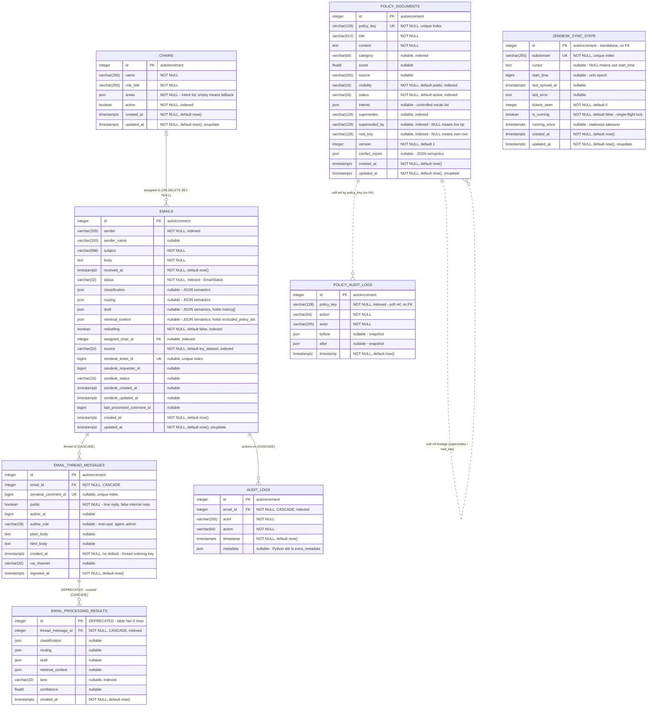

# ConfMail — Database Schema

**Introspected:** 2026-07-27 · **Alembic head:** `d5e6f7a8b9c0` (single head, fully applied)
**Source of truth:** the live PostgreSQL 16 database in the Docker `db` service, read via
`docker compose exec`. The SQLAlchemy models in `backend/app/db/models.py` were cross-checked
against it field-by-field and match 1:1.

> **Regenerate this document after any schema-changing migration.** It is hand-maintained,
> so it does not update itself. Re-introspect the live DB rather than transcribing from the
> ORM models — the models are a cross-check, not the authority.

To re-introspect:

```bash
docker compose exec backend sh -c 'cd /app/backend && alembic current'
docker compose exec db psql -U confmail -d confmail -c '\d+ <table>'
```

---

## Legend

| Marker | Meaning |
|---|---|
| `PK` / `FK` / `UK` | Primary key · foreign key · unique. Note every `UK` here is enforced by a **unique index** (`CREATE UNIQUE INDEX`), not a table constraint — so it has no `pg_constraint` entry and cannot be referenced by a foreign key. |
| Solid line `||--o{` | Enforced foreign key |
| Dotted line `||..o{` | **Soft reference** — matched in application code, *not* enforced by a DB constraint |
| ⚠️ **DEPRECATED** | Table still physically present but formally discarded; not written to, do not build on it |
| 🔶 JSON | Column whose internal structure carries meaning — see [JSON column semantics](#json-column-semantics) |

---

## Entity relationship diagram



`alembic_version` (single column `version_num varchar(32) PK`) is omitted above — it is
migration bookkeeping, not part of the domain.

---

## Tables

### `emails`
The central record: one incoming inquiry and its complete lifecycle state, whether it arrived
from the ticketing integration or a local dataset. A ticket maps 1:1 onto a row here, and all
four pipeline outputs (classification, routing, draft, retrieval context) hang off it as JSON
rather than separate tables. Every other email-scoped table is a child of this one.

### `email_thread_messages`
One message per row in a multi-turn conversation, ordered by `created_at`. The `public` flag
separates genuine replies to the requester from internal notes, which is load-bearing for both
display and reprocessing decisions. The initial inquiry is *derived by query* — the first public
end-user message in thread order — rather than stored as a flag.

### `email_processing_results` ⚠️ DEPRECATED
Was intended to hold per-follow-up-message pipeline results, keeping each message's own
classify→draft cycle separate from the parent email's. **Formally discarded** — the active
mechanism is `emails.draft.history[]` instead (see below). The table is still physically present
and holds **0 rows**; treat it as dead weight awaiting a drop migration, not as pending work.

### `policy_documents`
The knowledge-base corpus that grounds every generated reply. Rows carry both a trust axis
(`visibility`: public corpus vs. chair-authored internal) and a lifecycle axis (`status`:
indexed vs. retired), so a policy can be taken out of retrieval without deleting its history.
Chair edits create a new row that supersedes the old one rather than mutating in place.

### `policy_audit_logs`
Append-only governance trail for knowledge-base changes: who created, edited, retired, or
reactivated which policy, with full before/after snapshots. Deliberately keyed by `policy_key`
string with **no foreign key**, so the trail survives the row it describes being superseded or
removed. Distinct from `audit_logs`, which tracks email actions.

### `chairs`
The people who can be assigned human-review emails, with the intent areas each one owns. A chair
with an empty `areas` list is the catch-all fallback that receives anything no other active chair
claims. Deactivating rather than deleting keeps assignment history intact.

### `audit_logs`
Append-only record of every action taken on an email — classification, routing, chair assignment,
approval, send, redraft. This is the highest-volume table in the system and the primary forensic
tool for reconstructing what happened to a given ticket. Its `metadata` column is free-form
structured context that varies by action type.

### `zendesk_sync_state`
A single checkpoint row per ticketing account, holding the incremental-export resume cursor so
polling survives process restarts. Also carries the single-flight lock (`is_running` /
`running_since`) that stops two sync cycles from racing, with a staleness window so a crashed
run cannot block polling forever.

---

## JSON column semantics

All JSON columns use Postgres `json`, **not `jsonb`** — SQLAlchemy's dialect-agnostic `JSON`
type, chosen to keep the SQLite fallback working. Two practical consequences:

- Containment and key-existence operators need an explicit cast: `draft::jsonb ? 'history'`.
- **No GIN indexing is possible** on these columns as they stand. Any future
  query-by-JSON-key workload needs a migration to `jsonb` first.

### `emails.draft` — and `draft.history[]`, the active multi-turn mechanism

**This is the most important thing on this page that an ERD cannot show.** Draft revision
history is a JSON array nested inside `emails.draft`, not a table — so it appears nowhere as a
relationship, has no foreign key, and is invisible to schema tooling.

Top-level `draft` keys observed live: `draft_text`, `original_draft_text`, `notes_for_chair`,
`citations`, `placeholders`, `answer_confidence`, `is_edited`, `edited_by`, `model_used`,
`generation_metadata`, `send`, `history`.

When a follow-up arrives, the outgoing draft is pushed onto `draft.history[]` before being
overwritten. Each entry:

| Key | Meaning |
|---|---|
| `draft_text` | The superseded reply text |
| `notes_for_chair` | Chair-facing notes attached to that draft |
| `citations` | Policy chunks that draft was grounded on |
| `answer_confidence` | The drafter's self-rating for that draft |
| `is_edited` | Whether a chair had edited it before it was superseded |
| `superseded_at` | ISO-8601 UTC timestamp of replacement |
| `reason` | Why it was superseded |
| `triggering_comment_ids` | Thread comment ids that caused the reprocess |

Prior entries are copied forward **without their own nested history**, which is what keeps the
column from growing unbounded. Written by `_append_draft_history` in
`backend/app/pipeline/orchestrator.py`. Live: 66 rows carry the key, 65 non-empty.

`draft.send` is a nested object recording transport outcome: `mode`, `public`, `state`,
`status_set`, `tags_added`, `tag_conflict`.

### `emails.retrieval_context` — including policy exclusion

Captures the exact retriever inputs at ingest so a knowledge-base-change sweep can re-run
retrieval and compare grounding sets **without a model call**. Keys observed live:

| Key | Meaning |
|---|---|
| `query` | The retrieval query used |
| `intent` | Classified intent at retrieval time |
| `prior_intent` | Previous intent, when reclassified |
| `retrieved_ids` | The grounding set actually used |
| `chunk_hash` | Fingerprint for detecting a shifted top-k set |
| `forced_policy_key` | Chair manually added this policy (286 rows live) |
| `excluded_policy_ids` | Chair removed these citations (178 rows live) |

**Both curation fields are JSON-only — the policy-exclusion feature added no column and no
migration.** They are matched on *lineage root*, not literal `policy_key`, because an edit mints
a new key; exclusion always takes precedence over forcing.

### `emails.classification` / `emails.routing`

`classification`: `intent`, `confidence`, `raw_confidence`, `calibrated_confidence`,
`secondary_intents`, `method`, `reasoning`.
`routing`: `lane`, `reason`, `confidence_used`, `threshold_applied`, `override_reason`.

### Other JSON columns

- **`policy_documents.intents`** — list of intents this chunk can answer, from a controlled
  vocabulary. Live: 93 of 94 rows populated.
- **`policy_documents.conflict_report`** — last computed conflict analysis against similar
  policies. `NULL` means never checked. Live: 0 rows populated.
- **`chairs.areas`** — flat list of intent strings, e.g.
  `["submission_requirements", "submission_format_policy"]`. Empty list = fallback chair.
- **`audit_logs.metadata`** — free-form, varies by action. Keys seen include `chair_id`,
  `chair_name`, `chunk_ids`, `confidence`, `intent`, `is_fallback`, `lane`, `matched_area`,
  `model_used`, `override_reason`, `reason`, `status`, `strategy`. Note the Python attribute is
  `extra_metadata` (`metadata` is reserved on the declarative base); the **column** is `metadata`.
- **`policy_audit_logs.before` / `after`** — full row snapshots either side of a change.

---

## Value domains

These are string columns, not database enums — no `CREATE TYPE` exists. Validation lives in
Python. **Declared values are authoritative**; live coverage is noted separately because current
data exercises only part of each domain.

### `emails.status` — `EmailStatus`, all 9 declared values

| Value | Meaning |
|---|---|
| `PENDING` | Ingested, not yet processed |
| `CLASSIFIED` | Intent assigned |
| `ROUTED` | Lane decided |
| `DRAFT_GENERATED` | Reply drafted, awaiting review |
| `APPROVED` | Chair approved, not yet sent |
| `SENT` | Reply delivered to requester |
| `SOLVED` | Resolved **without** a reply — nothing went to the requester |
| `SEND_FAILED` | Transport attempted and failed; draft preserved, re-triable |
| `ARCHIVED` | Ingested for visibility only, no pipeline run |

> **Live coverage:** only 4 of the 9 appear in current data — `PENDING`, `ROUTED`,
> `DRAFT_GENERATED`, `SENT`. The other 5 are valid and reachable; the current dataset simply has
> not exercised them. Do not infer from the data that they are unused.

### Other domains

| Column | Declared | Live |
|---|---|---|
| `emails.source` | `toy_dataset`, `zendesk` | all rows `zendesk` |
| `emails.zendesk_status` | `new`, `open`, `pending`, `hold`, `solved`, `closed` | all but `hold` |
| `email_thread_messages.author_role` | `end-user`, `agent`, `admin` | all three |
| `policy_documents.visibility` | `public`, `internal` | both |
| `policy_documents.status` | `active`, `inactive` | all rows `active` |
| `routing.lane` (JSON) | `faq`, `human_review` | both |

> ⚠️ **Lane vocabulary divergence — read before writing any query on `routing.lane`.** The
> persisted values are lowercase `faq` / `human_review`, from the `LANE_FAQ` / `LANE_HUMAN_REVIEW`
> constants in `backend/app/pipeline/router.py`. The `RoutingLane` enum in
> `backend/app/models/enums.py` declares a *different* vocabulary (`AUTO_REPLY` / `HUMAN_REVIEW`)
> that is **not** what reaches the database. Filtering on `AUTO_REPLY` silently matches nothing.
> The deprecated `email_processing_results.lane` column's docstring also references the enum
> vocabulary, but that table is empty, so nothing depends on it.

---

## Deprecated and unexercised

| Item | State |
|---|---|
| `email_processing_results` (whole table) | ⚠️ **DEPRECATED** — formally discarded, 0 rows, superseded by `emails.draft.history[]`. Still physically present; awaiting a drop migration. |
| `policy_documents.supersedes` / `superseded_by` / `root_key` / `version` | Columns exist and are indexed; lineage is **unexercised** — 0 superseded rows, `max(version) = 1`. |
| `policy_documents.conflict_report` | Column exists; 0 rows populated. |
| `policy_documents.tags` | **Already dropped** by migration `e7a9c1f2b3d4` after an ablation found no retrieval signal. Application-side tag path is commented out, not deleted, marked `[tags-dropped E007]`. |

---

## Row counts at introspection

| Table | Rows |
|---|---|
| `audit_logs` | 15,332 |
| `email_thread_messages` | 5,225 |
| `emails` | 2,653 |
| `policy_documents` | 94 |
| `chairs` | 5 |
| `policy_audit_logs` | 1 |
| `zendesk_sync_state` | 1 |
| `email_processing_results` | 0 |
